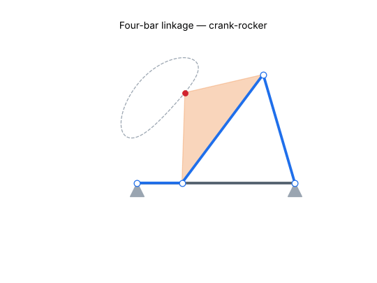
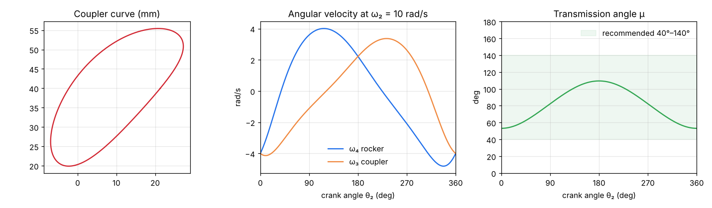
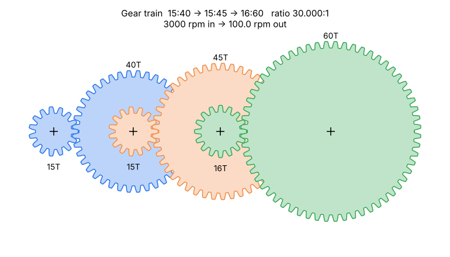

# Mechanism Designer


Python tools for two of the most common problems in machine design:

1. **Four-bar linkage analysis**: Grashof classification, position and velocity analysis, transmission angle and coupler curves, with an animated preview.
2. **Spur gear-train design**: give it a target ratio and it picks tooth counts for a 1, 2 or 3-stage gearbox, checks every mesh for tooth interference, and reports output speed and torque.

Every result is checked against a hand calculation in the test suite.

<p align="center"></p>

---

## Quick start

```bash
git clone https://github.com/ryanch3nn/mechanism-designer.git
cd mechanism-designer
pip install -e ".[dev]"

python examples/fourbar_demo.py   # analysis plots + GIF -> docs/img/
python examples/gear_demo.py      # designs a 30:1 gearbox
pytest                            # run the test suite
```

```python
from mechdesign import FourBar, design_train

fb = FourBar(ground=70, crank=20, coupler=60, rocker=50)
fb.summary()
# {'type': 'crank-rocker', 'grashof': True, 'full_rotation': True,
#  'output_swing_deg': 47.74, 'min_transmission_deg': 53.13}

train = design_train(30)          # 3000 rpm motor -> 100 rpm output
print(train.report(speed_in_rpm=3000, torque_in_Nm=0.25))
```

```
Meshes: [(15, 40), (15, 45), (16, 60)]  (module 1.0 mm)
Ratio: 30.0000 : 1   direction: reversed
Input    3000.0 rpm     0.250 N·m
Output   -100.0 rpm     7.059 N·m  (efficiency 94.1%)
Center distances (mm): [27.5, 30.0, 38.0]
Interference: OK
```

---

## 1. Four-bar linkage

Link lengths: ground $r_1$, input crank $r_2$, coupler $r_3$, output rocker $r_4$. The ground pivots sit at $O_2=(0,0)$ and $O_4=(r_1,0)$.

### Grashof condition
With $s$ the shortest link, $l$ the longest, and $p, q$ the other two:

$$s + l \le p + q$$

If this holds, at least one link can rotate fully. Which one depends on where the shortest link is:

| Shortest link | Type |
|---|---|
| ground | double-crank |
| crank (input) | crank-rocker |
| coupler | double-rocker |
| rocker (output) | rocker-crank |
| (condition fails) | triple-rocker (non-Grashof) |
| $s + l = p + q$ | change-point |

### Position analysis
The crank pin is at $A = r_2(\cos\theta_2, \sin\theta_2)$. Joint $B$ has to be $r_3$ from $A$ and $r_4$ from $O_4$, so it sits where those two circles intersect. The two intersections are the **open** and **crossed** assembly branches. If the circles don't intersect, the linkage can't reach that crank angle.

### Velocity analysis
Differentiating the vector loop $r_2e^{i\theta_2} + r_3e^{i\theta_3} - r_4e^{i\theta_4} - r_1 = 0$ with respect to time gives a 2×2 linear system:

$$\omega_3 = \frac{r_2\,\omega_2\,\sin(\theta_4-\theta_2)}{r_3\,\sin(\theta_3-\theta_4)} \qquad \omega_4 = \frac{r_2\,\omega_2\,\sin(\theta_2-\theta_3)}{r_4\,\sin(\theta_4-\theta_3)}$$

The denominator goes to zero at the **toggle positions**, where the coupler and rocker line up and the velocity ratio blows up.

### Transmission angle
The transmission angle $\mu$ is the angle between the coupler and the rocker. It measures how well force gets passed to the output. With diagonal $d^2 = r_1^2 + r_2^2 - 2r_1r_2\cos\theta_2$:

$$\cos\mu = \frac{r_3^2 + r_4^2 - d^2}{2\,r_3\,r_4}$$

A common design rule is to keep $\mu$ between 40° and 140°.



---

## 2. Spur gear trains

For a compound train with $k$ meshes, per-mesh efficiency $\eta$, and module $m$:

$$e = \prod \frac{N_\text{driven}}{N_\text{driver}} \qquad n_\text{out} = \frac{n_\text{in}}{e} \qquad T_\text{out} = T_\text{in}\, e\, \eta^{k} \qquad C = \frac{m(N_1 + N_2)}{2}$$

Each external mesh reverses the direction of rotation. An idler gear cancels out of the ratio but still flips the direction.

### Interference
A pinion with too few teeth will have its tooth tips dig into the gear's tooth roots. For full-depth teeth ($k = 1$), pressure angle $\phi$, and gear ratio $m_G = N_G/N_P$ (Shigley, eq. 13-11), the smallest safe pinion is

$$N_P = \frac{2k}{(1+2m_G)\sin^2\phi}\left(m_G + \sqrt{m_G^2 + (1+2m_G)\sin^2\phi}\right)$$

At $\phi = 20°$ this gives 13 teeth for a 1:1 mesh and 18 teeth against a rack.

### How the designer picks tooth counts
1. Enumerate every interference-free (driver, driven) pair in the allowed tooth range.
2. For each distinct ratio, keep only the pair with the fewest teeth.
3. Build a sorted table of all two-stage combinations. Each 3-stage design is then one single-stage pick plus a binary search in that table, so the search takes about half a second instead of brute-forcing billions of combinations.
4. Return the design with the **fewest stages**, and within that the **fewest total teeth**, whose ratio is within 0.1 % of the target.



---

## Validation

| Test | Hand calculation |
|---|---|
| Parallelogram linkage (4, 2, 4, 2) at θ₂ = 60° | θ₄ = θ₂, ω₃ = 0, ω₄ = ω₂ |
| Transmission angle, (70, 20, 60, 50) at θ₂ = 0 | cos μ = (6² + 5² − 5²)/(2·6·5) = 0.6 → 53.13° |
| Velocity solution | matches a central finite difference of θ₄ |
| Loop closure over a full turn | \|AB\| = r₃ and \|O₄B\| = r₄ at every angle |
| 20→60, 15→45 compound train | e = 9, T_out = 9 · 0.98² · T_in, C = m(N₁ + N₂)/2 |
| Minimum pinion teeth | 13 (1:1), 16 (4:1), 18 (rack), matching Shigley |

## Project layout

```
mechdesign/fourbar.py   linkage kinematics and animation
mechdesign/gears.py     gear-train analysis, interference, designer, drawing
examples/               scripts that generate every figure in this README
tests/                  pytest suite (runs on every push via GitHub Actions)
```

## Limitations and roadmap
- [ ] Acceleration analysis and joint forces (inertia and static force analysis)
- [ ] Three-position linkage synthesis: design a linkage that passes through given poses
- [ ] Lewis bending stress and face-width sizing for gears
- [ ] Planetary gear sets (internal meshes are supported in `GearTrain`, but the interference check skips them)
- [ ] Export gear profiles to DXF for laser cutting or CAD

The gear outlines in the drawings are approximate and meant for diagrams only, not true involute profiles for manufacturing.

## References
- R. G. Budynas and J. K. Nisbett, *Shigley's Mechanical Engineering Design*, ch. 13
- R. L. Norton, *Design of Machinery*, ch. 2–6

## License
MIT
